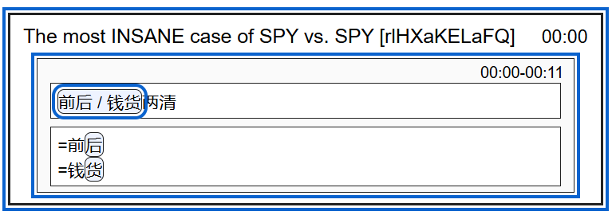

instances such as the above indicate learner points of failure:

1. fuzzy signal
   1. "hou" vs "huo" not confidently discerned from base signal, perhaps because:
      1. truly not clear in original audio
      2. novel expression triggerd automatical fallback
2. novel phrase
   1. 钱货两清 unknown, thus the user needed to fall back to:
      1. reliance on base signal interpretation;

disam options selected by the user give indication of the fuzzy part of base signal (= syllable final);  we can also look at the specific set of finals being fuzzy to bias a training set when practicing this

    -> this may be candidate practice grame trigger. can use known vs novel genreated sentences.

    -> in introducing meaning of novel words / expressions, EDGE OF TOMORROW brain-bug style visions can show meaning options

    -> qwen tts can genreate voice for sentences
